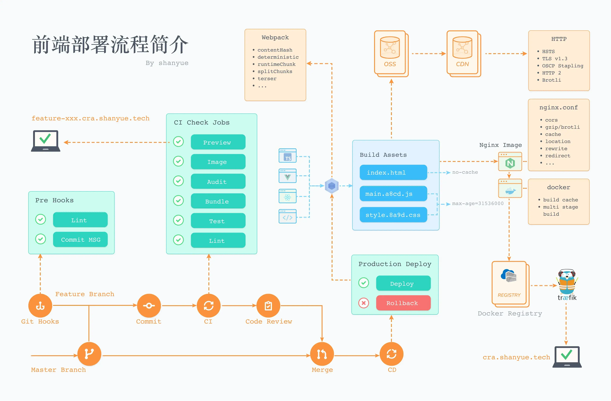
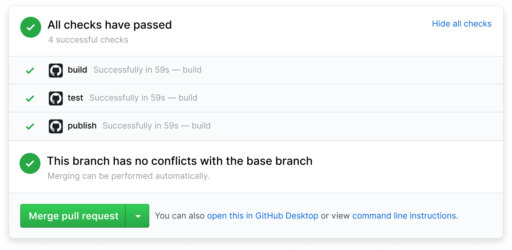
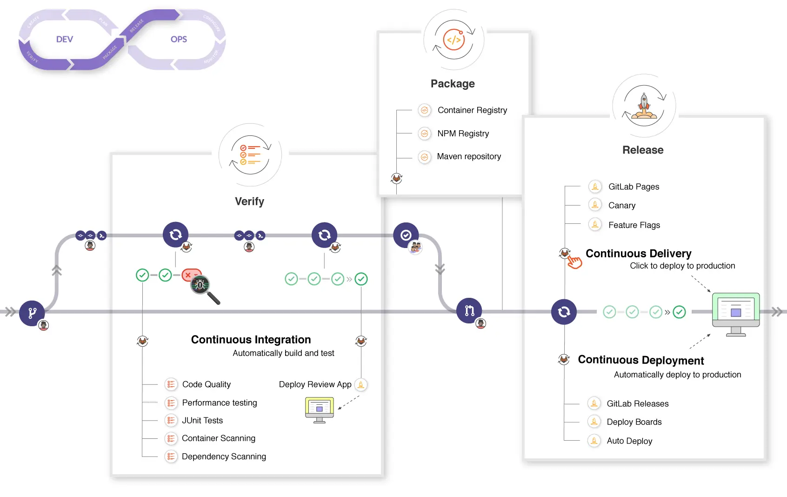
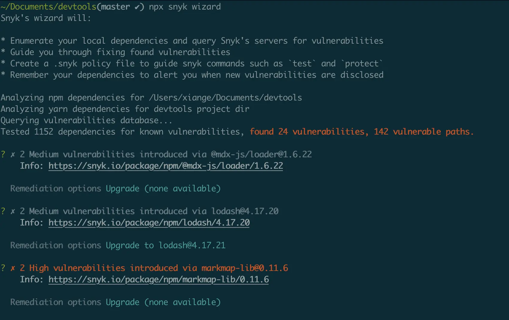

# 前端部署相关



## CICD

`CI`: Continuous Integration，持续集成

`CD`: Continuous Deployment，持续部署

从开发、测试到上线的过程中，借助于 CICD 进行一些自动化处理，保障项目质量。

`CICD` 与 `git` 集成在一起，可理解为服务器端的 `git hooks`: 当代码 `push` 到远程仓库后，借助 `WebHooks` 对当前代码在构建服务器(即 `CI` 服务器，也称作 `Runner`)中进行自动构建、测试及部署等。

### CICD 的好处

1. 分支提交后，执行自动化测试、语法检查，如未通过则阻止合并和上线

2. 分支提交后，可以检查 npm 库的风险和构建镜像容器的风险

3. 可以对每一个功能分支生成一个可供测试的地址，例如`<branch>.dev.technolegy.com`

4. 功能分支测试通过后，合并到主分支，自动构建镜像并部署到生产环境（生产环境一般需要手动触发部署）



由于近些年来 `CICD` 的全面介入，项目开发的工作流就是 `CICD` 的工作流，以下是一个比较完善的 `CICD Workflow`。



### CICD 的相关工具

CICD 集成于 `CICD` 工具及代码托管服务。`CICD` 有时也可理解为进行 `CICD` 的构建服务器，而提供 `CICD` 的服务，如以下产品，将会提供构建服务与 `github`/`gitlab` 集成在一起。

`jenkins`

`Travis CI`

个人用户还可以使用 github 提供的免费服务`github actions`（每个月 2000 分钟额度）

企业一般是自建`gitlab Runner`作为构建服务器

### 配置示例

```yml
deploy:
  stage: deploy
  only:
    - master
  script:
    - docker build -t wwwroot/fe/devtools-app
    - docker push wwwroot/fe/devtools-app
    - helm upgrade -install devtools-app-chart .
```

## git hooks

`git` 允许在各种操作之前添加一些 `hook` 脚本，如未正常运行则 `git` 操作不通过。最出名的还是以下两个

1. `precommit`

2. `prepush`

`hook` 脚本置于目录 `~/.git/hooks` 中，以可执行文件的形式存在

```shell
$ ls -lah .git/hooks
applypatch-msg.sample     pre-merge-commit.sample
commit-msg.sample         pre-push.sample
fsmonitor-watchman.sample pre-rebase.sample
post-update.sample        pre-receive.sample
pre-applypatch.sample     prepare-commit-msg.sample
pre-commit.sample         update.sample
```

另外 git hooks 可使用 core.hooksPath 自定义脚本位置。

```shell
# 可通过命令行配置 core.hooksPath
$ git config 'core.hooksPath' .husky

# 也可通过写入文件配置 core.hooksPath
$ cat .git/config
[core]
  ignorecase = true
  precomposeunicode = true
  hooksPath = .husky
```

`husky`可以通过自定义`core.hooksPath`，将`npm scripts`写入其中的方式来实现功能。

~/.husky 目录下手动创建 hook 脚本。

```shell
# 手动创建 pre-commit hook
$ vim .husky/pre-commit
```

在 pre-commit 中进行代码风格校验

```shell
#!/bin/sh

npm run lint
npm run test
```

## Audit

译为`审计`，用于检查所有依赖是否安全，通过`npm audit`和`yarn audit`启动。

通过审计可以发现有风险的包，依赖库的依赖链，风险原因及解决方案。

```shell
# 审计生产风险
npm audit production
yarn audit dependencies

# 修复风险，原理就是升级依赖库，升级至已修复了风险的版本号
npm audit fix
```

`synk`是个高级版的`npm audit`，可以自动修复



## Docker

使用`docker`部署前端的最大好处是隔离环境，比如下面几种情况

1. 前端项目依赖于 Node v16，而宿主机无法满足依赖，使用容器满足需求

2. 前端项目依赖于 npm v8，而宿主机无法满足依赖，使用容器满足需求

3. 前端项目需要将 8080 端口暴露出来，而容易与宿主机其它服务冲突，使用容器与服务发现满足需求

`docker`部署的基本流程

CICD 生成 docker 镜像 -> 上传到 DockerHub -> 服务器从 DockerHub 下载最新版本的镜像 -> 通过镜像启动容器，同时映射端口号和配置对应的 nginx

### 生成 Docker 镜像

一个能生成镜像的 Dockerfile 如下：

```shell
# 指定 node 版本号，满足宿主环境
FROM node:16-alpine

# 指定工作目录，将代码添加至此
WORKDIR /code
ADD . /code

# 在镜像中安装依赖并将项目跑起来
RUN npm install
RUN npm run build
CMD npm start

# 暴露出运行的端口号，可对外接入服务发现
EXPOSE 8080
```

```shell
# 构建镜像
$ docker build -t fe-app .

# 运行容器
$ docker run -it --rm fe-app
```

但是上述流程还有优化空间，主要体现在以下几方面

1. 使用 `node:16` 作为基础镜像过于奢侈，占用体积太大，而最终产物 (`js`/`css`/`html`) 无需依赖该镜像。可使用更小的 `nginx` 镜像做多阶段构建。

2. 多个 `RUN` 命令，不利于 `Docker` 的镜像分层存储。可合并为一个 `RUN` 命令

3. 每次都需要 `npm i`，可合理利用 `Docker` 缓存，`ADD` 命令中内容发生改变将会破坏缓存。可将 `package.json` 提前移至目标目录，只要 `package.json`/`lockfile` 不发生变动，将不会重新 `npm i`

优化后如下

```shell
FROM node:16-alpine as builder

WORKDIR /code

ADD package.json package-lock.json /code/
RUN npm install

ADD . /code

RUN npm run build

# 选择更小体积的基础镜像
FROM nginx:alpine

# 将构建产物移至 nginx 中
COPY --from=builder code/build/ /usr/share/nginx/html/
```

### 对分支环境进行部署

这是一种基于容器及 `docker-compose` 或者 `k8s` 的思路

1. 借用现有的 `CICD` 服务，如 `github actions` 或者 `gitlab CI` 获取当前分支信息

2. 借用 `Docker` 快速部署前端或者后端，根据分支信息启动不同的服务 (`Service`)，根据 `Docker` 启动服务并配置响应的标签 (`Label`)

3. 根据容器的标签与当前 `GIT` 分支对前端后端设置不同的域名

下面是一个 Preview 的示例

```yml
version: '3'
services:
  cra-preview-${COMMIT_REF_NAME}:
    build:
      context: .
      dockerfile: router.Dockerfile
    labels:
      # 配置域名: Preview
      - 'traefik.http.routers.cra-preview-${COMMIT_REF_NAME}.rule=Host(`${COMMIT_REF_NAME}.cra.kevinlau.cn`)'
      - traefik.http.routers.cra-preview-${COMMIT_REF_NAME}.tls=true
      - traefik.http.routers.cra-preview-${COMMIT_REF_NAME}.tls.certresolver=le
```
