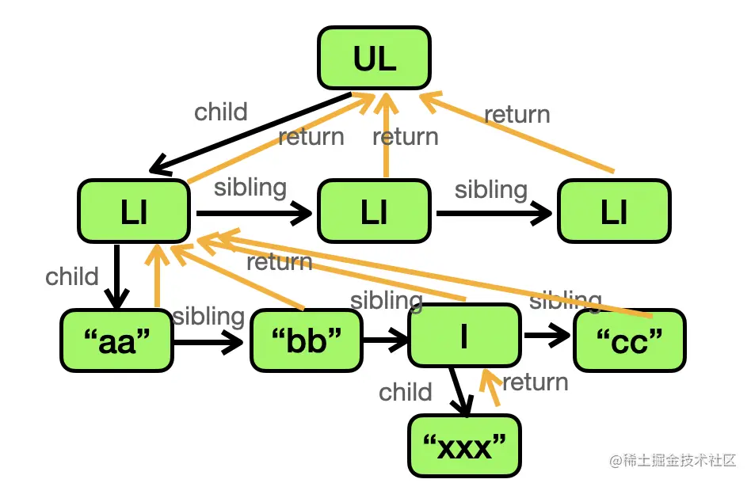

# React 的 Fiber 架构代码结构解析

React 下的 Fiber 架构，分为三大块`reconcile`, `schedule`, `commit`

## schedule

schedule 是 React 的主流程，它的核心逻辑是闲时调度

### ReactDom 的核心流程

```js
// 下一个任务的指针
let nextFiberReconcileWork = null;

// 正在构建的fiber根节点
let wipRoot = null;

/**
 * 无限循环的任务（闲时调度，每一帧绘制完就执行一遍）
 */
function workLoop(deadline) {
  // 是否暂停任务
  let shouldYield = false;

  // 递归调用最小的「处理单元」，直到暂停为止
  while (nextFiberReconcileWork && !shouldYield) {
    // 构建一个fiber和它的子节点，然后指向下一个需要构建的fiber
    nextFiberReconcileWork = performNextWork(nextFiberReconcileWork);
    // 每构建一轮，就判断一下是否有剩余时间
    shouldYield = deadline.timeRemaining() < 1;
  }

  // 进下一轮循环
  requestIdleCallback(workLoop);
}

requestIdleCallback(workLoop);
```

### 总结

schedule 通过闲时调度，逐步执行每个 fiber 节点的 reconcile（vdom 转 fiber）

当 reconcile 执行完毕（nextFiberReconcileWork === null），进入 commit 阶段

## reconcile



### 最小的处理单元：performNextWork

```js
// 返回下一个fiber的处理单元，或者null
function performNextWork(fiber) {
  // 「递」阶段
  // 构造当前节点和它的子节点
  reconcile(fiber);
  // 深度优先，指向子节点，也就是说让子节点进到下一个「处理单元」
  if (fiber.child) {
    return fiber.child;
  }
  // ==================
  // 结束此轮「处理单元」
  // ==================

  // 去到叶子节点了
  // 进入「归」阶段
  // 不断指向兄弟节点和父节点
  let nextFiber = fiber;
  // 这个while最终会指向「根节点」的return，也就是null，「递归」完成
  while (nextFiber) {
    if (nextFiber.sibling) {
      return nextFiber.silbling;
    }
    // 回到父节点，转而去构造父节点的兄弟节点
    nextFibling = nextFibling.return;
  }
}
```

### 单个节点的 reconcile 过程

```js
function reconcile(fiber) {
  if (!fiber.dom) {
    // 把当前节点对应的dom节点创建出来
    fiber.dom = createDom(fiber);
  }
  // 遍历子节点
  reconcileChildre(fiber, fiber.props.children);
}

function reconcileChildren(wipFiber, elements) {
  let index = 0;
  let prevSibling = null;
  while (index < elements.length) {
    // 当前子节点原始信息
    let element = elements[index];
    // 创建fiber节点
    let newFiber = {
      type: element.type,
      props: element.props,
      dom: null
      return: wipFiber,
      effectTag: 'PLACEMENT' // 标记为新增元素
    };
    // 父->child->当前
    if (index === 0) {
      wipFiber.child = newFiber;
    }
    // 上一个兄弟->sibling->当前
    if (prevSibling) {
      prevSibling.sibling = newFiber;
    }
    // 记录到前一个，进下一轮循环
    prevSibling = newFiber;
    i++;
  }
}
```

### 执行 render 方法，启动 reconcile 流程

基于以上的逻辑，我们的准备工作已经完成了

注意在以上逻辑的实现中，由于 wipRoot 始终是为空的

所以，`workLoop`始终无法命中进入`performNextWork`的逻辑

那么在什么时候给 wipRoot 赋值呢，就是`render`方法

```js
function render(element, container) {
  wipRoot = {
    dom: container,
    props: {
      children: [element],
    },
  };
  nextFiberReconcileWork = wipRoot;
}
```

### 总结

由于篇幅有限，以上只涉及到 mount 过程，不涉及 update 过程，在 update 过程中也会进入到`reconcile`方法中，经过 diff 算法，把`effectTag`标记为「增」「删」「改」。

reconcile 做的事情：

- 1. 负责把*虚拟 DOM*转*Fiber*

- 2. 准备好 `Fiber` 对应的 `DOM` 节点，同时标记好是增、删还是改

- 3. 接受 `schedule` 的调度

## commit

commit 做的事情就是对 dom 进行增删改，并且这个过程远比比 react v15 的栈调和要快，因为 fiber 的 dom 节点已经在 reconcile 阶段提前创建好了。

### 核心流程

```js
function commitRoot() {
  // commitWork会一次性把所有更新执行完毕
  commitWork(wipRoot.child);

  // 此时需要清空wipRoot，等待下一轮render执行的时候再重新调度
  wipRoot = null;
}
```

```js
function commitWork(fiber) {
  if (!fiber) {
    return;
  }

  let domParentFiber = fiber.return;

  // 缺少dom，去父节点的父节点寻找
  while (!domParentFiber.dom) {
    domParentFiber = domParentFiber.return;
  }
  const domParent = domParentFiber.dom;

  // 处理新增
  if (fiber.effectTag === "PLACEMENT" && fiber.dom !== null) {
    domParent.appendChild(fiber.dom);
  }

  // 处理子节点，深度优先
  commit(fiber.child);
  commit(fiber.sibling);
}
```

回过头看一下 reconcile 流程中创建的 DOM 节点

```js
/**
 * 创建dom节点
 */
function createDom(fiber) {
  const dom =
    fiber.type === "TEXT_ELEMENT"
      ? document.createTextNode("")
      : document.createElement(fiber.type);
  for (const prop in fiber.props) {
    setAttribute(dom, prop, fiber.props[value]);
  }
  return dom;
}

/**
 * 设置dom属性
 */
function setAttribute(dom, key, value) {
  if (key === "children") return;

  if (key === "nodeValue") {
    // 处理文本节点
    dom.textContent = value;
  } else if (isEventListenerAttr(key, value)) {
    const eventType = key.slice(2).toLowerCase();
    // 实际上在React源码中使用的是重新注册的合成事件
    dom.addEventListener(eventType, value);
  } else if (isStyleAttr(key)) {
    // 合并style
    Object.assign(dom.style, value);
  } else if (isPlainAttr(key, value)) {
    // 纯粹的属性
    dom.setAttribute(key, value);
  }
}

function isEventListenerAttr(key, value) {
  return /^on/.test(key) && typeof value === "function";
}

function isStyleAttr(key, value) {
  return key === "style" && typeof value === "object";
}

function isPlainAttr(key, value) {
  return typeof value !== "object" && typeof value !== "function";
}
```

### 3 个阶段

实际上 commit 有 3 个阶段：before mutation, mutation, layout

具体执行 dom 操作的阶段是 mutation

所以 render 的完整流程应该是：

```
render + commit(before mutation, mutation, layout)
```

## 拓展问题：hooks 的数据保存在哪里，何时产生？

答案是，在`fiber`的`memoizedState`链表上存储，

当`js`调用*第一次*`useXxx`的 api 时，会构造这个链表。

用 useRef 源码举例

```js
function useRef(initialValue) {
  currentHookNameInDev = "useRef";
  mountHookTypesDev();

  // 第一次调用触发mount
  return mountRef(initialValue);
  // 第二次调用触发udpate
  // return updateRef()
}

function mountRef(initialValue) {
  const hook = mountWorkInProgressHook();
  const ref = {
    current: initialValue,
  };
  hook.memoizedState = ref;
  return ref;
}

function updateRef() {
  const hook = mountWorkInProgressHook();
  return hook.memoizedState;
}

function mountWorkInProgressHook() {
  const hook = {
    memoizedState: null,
    // ...
  };
  if (workInProgressHook === null) {
    currentlyRenderingFiber.memoizedState = workInProgressHook = hook;
  } else {
    workInProgressHook = workInProgressHook.next = hook;
  }
  return workInProgressHook;
}
```

:::
总结：`hook` 的数据是存放在 `fiber` 的 `memoizedState` 属性的链表上的，每个 `hook` 对应一个节点，第一次执行 `hook api` 的时候会走 `mount` 的逻辑创建链表，之后会走 `update` 的逻辑获取数据。
:::

拓展阅读：[https://juejin.cn/post/7203336895887114300?searchId=20231203145151C2E3FF1CBC41E7D831CD](https://juejin.cn/post/7203336895887114300?searchId=20231203145151C2E3FF1CBC41E7D831CD)

## 拓展问题：useState 和 useEffect 的实现原理

### useEffect

先看`useEffect`

`useEffect` 的 `hook` 在 `render` 阶段会把 `effect` 放到 `fiber` 的 `updateQueue` 中，这是一个 `lastEffect.next` 串联的环形链表

在 `commit` 阶段会**异步**执行所有 `fiber` 节点的 `updateQueue` 中的 `effect`

而 `useLayoutEffect` 则是在 `commit` 的 `layout` 阶段**同步**执行所有 `fiber` 节点的 `effect。`

### useState

useState 返回两个参数，state 和 setState

- state: 返回当前链表的 state

- setState: 是一个 dispatch 函数，绑定到了当前 fiber 的 queue 上

调用 setState 的时候，会创建一个 update 对象标记 fiber 节点，调度下次渲染

在调度更新的时候会去看 fiber 的 lane

lane 有 30 多种优先级，react 采用二进制来保存他们，这样就可以通过**位运算**快速算出是什么优先级。

创建完 update 对象后需要标记 fiber 节点更新，并且从父节点冒泡到根节点。调用的方法是`markUpdateFromFiberToRoot`。

标记完成后，调用`scheduleUpdateOnFiber`方法调度渲染

最终执行到`renderRootSync`，这个方法可以理解为**从根节点开启新的 vdom 转 fiber 的循环**，从而触发了下一轮的渲染

这还没完。。。

下一轮渲染的时候会执行当前的函数组件，再执行到`useState`的时候，就会进入`updateState`的流程。

`updateState`最终会调用`updateReducer`选出最终的 state 返回给 useState 的第一个参数来做渲染。

---

小结：

useState 分为 mountState 和 updateState 两个阶段。

mountState 返回 state 和 dispatch 函数，dispatch 函数会把记录更新到 hook.queue，然后从当前 fiber 一直标记到到根 fiber 的 lane 需要更新，然后调度下次渲染。

再次渲染的时候会进入 updateState，取出 hook.queue，根据优先级确定最终的 state 返回，然后渲染出最新的结果。
