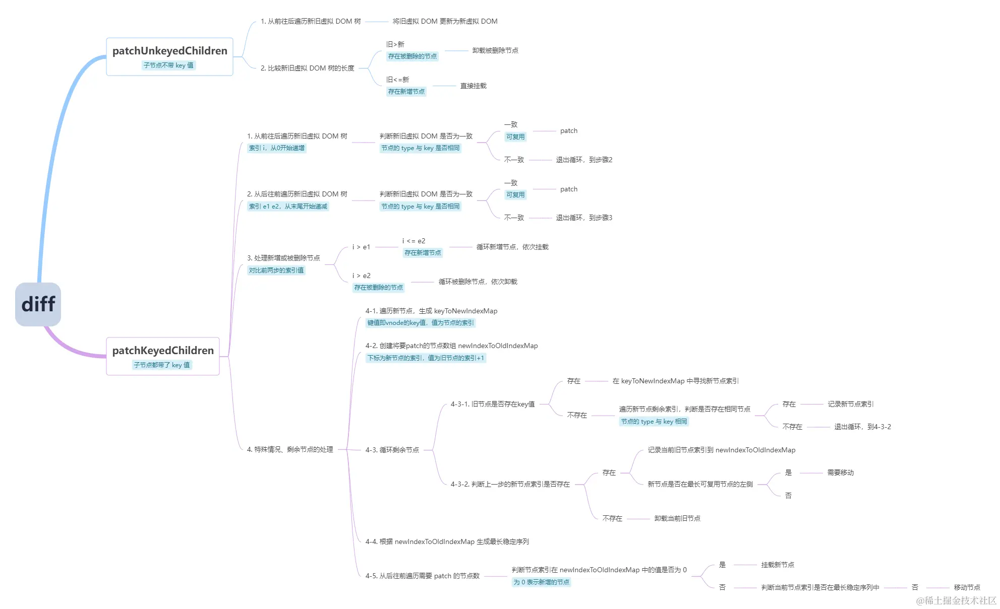

# Vue 的 diff 过程

当组件创建和更新时，Vue 均会执行内部的 update 函数，该函数在内部调用 render 函数生成虚拟 DOM 树，组件会指向新树，然后 Vue 将新旧两棵树进行对比找到差异点，最终更新到真实 DOM。

对比差异的过程叫做 diff，Vue 在内部通过一个叫 patch 的函数完成该过程。

在对比时，vue 采用深度优先，逐层比较的方式进行比对。

在判断两个节点是否相同时，vue 是通过对比虚拟节点的 key 和 tag 来进行判断的。

具体来说，首先对根节点进行对比，如果相同，则将旧节点关联的真实 DOM 挂载到新节点上，然后根据需要更新属性到真实 DOM，然后再对比子节点数组；

如果根节点不相同，则按照节点的信息递归创建所有真实 DOM，同时挂载到对应的虚拟节点上，然后移除掉旧的 DOM。

在对比子节点数组时，vue 对每个子节点数组使用了两个指针，分别指向头和尾，然后不断向中间靠拢来进行对比。这样做的目的是尽量复用真实 DOM，尽可能少地销毁和创建真实 DOM。如果发现子节点相同，则进入和根节点一样的对比流程，如果发现不同，则移动真实 DOM 到合适的位置。

这样一直递归遍历下去，直到整棵树完成对比。

---

在浏览器中直接执行 DOM 操作是昂贵的，并不是说 Vue 操作 DOM 的性能要比原生的好，而是 Vue 的底层能够计算出视图更新更新执行 DOM 操作的最少节点，这个计算过程比我们直接批量更新 DOM 的开销要小得多，这也是虚拟 DOM 存在的意义。

## 流程概述

### 术语解释

1. **相同**：是指两个虚拟节点的标签类型和 key 值均相同，input 元素还需要看 type 属性

2. **新建元素**：是指根据一个虚拟节点提供的信息，创建一个真实 DOM 元素，同时挂载虚拟节点的 elm 属性上

3. **销毁元素**：是指`vnode.elm.remove()`

4. **更新**：是指对两个虚拟节点进行对比更新，它仅发生在两个虚拟节点**相同**的情况下

### 详细流程

1. **根节点比较**

- 如果两个节点**相同**，则进入更新流程

  - 1. 将旧节点的真实 DOM **赋值**到新节点上

  - 2. 对比新节点和旧节点的**属性**，将有变化部分的更新到真实 DOM 中

  - 3. 当前两个节点处理完毕，开始**对比子节点**

- 如果两个节点不**相同**

  - 1. 新节点递归**新建元素**

  - 2. 旧节点**销毁元素**

2. **对比子节点**

在对比子节点时，vue 一切的出发点都是为了：

- 尽量啥也别做

- 不行的话，尽量改动元素属性

- 还不行的话，尽量移动元素，而不是删除和创建元素

- 还不行的话，删除和创建元素

具体做法分 2 种情况考虑：

1. 不带 key 的新虚拟 DOM 树

- 从前到后遍历新旧虚拟 DOM 树，将旧虚拟 DOM 更新为新的虚拟 DOM

- 比较新旧虚拟 DOM 树的长度，处理新增和删除的节点

2. 带 key 的新虚拟 DOM 树，采用双指针的方式

- 头尾指针往中间靠拢，依次比较：头-头、尾-尾、头-尾、尾-头，如果相同则进入 patch 流程，同时头-尾情况需要调整顺序

- 如果上述情况都不相同，则根据 key 查找是否有可以复用的元素，如果有则进入 patch 流程，同时调整顺序

- 当新的子节点或者旧的子节点遍历完时，遍历剩余的节点执行创建或删除的操作

<!-- - 从前到后遍历新旧虚拟 DOM 树，寻找可复用节点，遇到不可复用节点就跳出循环

- 从后往前遍历新旧虚拟 DOM 树，寻找可复用节点，遇到不可复用节点就跳出循环

- 对比前两次遍历的索引，识别出两侧与中间新增与删除的节点

- 处理未识别出的节点 -->

## Vue3 的 diff 优化

### 数结构打平

`vue2` 在对比新旧树的时候，并不知道哪些节点是静态的，哪些是动态的，因此只能一层一层比较，这就浪费了大部分事件在比对静态节点上。

Vue3 中编译的结果会被打平为一个数组，仅包含所有动态的后代节点。

这大大减少了我们在虚拟 DOM 协调时需要遍历的节点数量。模板中任何的静态部分都会被高效地略过。

### PatchFlag

`vue3` 相比 `vue2`，主要是在编译时（AOT）做了优化，增加了静态标记。

静态标记的作用是为了在会发生变化的虚拟节点上增加一个 flag 标记，下次发生变化的时候直接找这个地方进行比较，从而进一步地提升性能。

同时，已经被标记为静态节点的 vnode 则不会再进行比较。

关于静态类型的一些枚举如下：

```ts
export const PatchFlags = {
  TEXT: 1, // 动态的文本节点
  CLASS: 1 << 1, // 2 动态的class
  STYLE: 1 << 2, // 4 动态的style
  PROPS: 1 << 3, // 8  动态属性
  FULL_PROPS: 1 << 4, // 动态的key
  HYDRATE_EVENTS: 1 << 5, // 事件监听器
  STABLE_FRAGMENT: 1 << 6, // 一个不会改变子节点的Fragment
  KEYED_FRAGMENT: 1 << 7, // 带有key属性的Fragment
  UNKEYED_FRAGMENT: 1 << 8, // 子节点没有key的Fragment
  NEED_PATCH: 1 << 9, //
  DYNAMIC_SLOTS: 1 << 10, // 动态slot
  HOISTED: -1, // 表示永远不会用作diff
  BAIL: -2, // 指代差异算法
};
```

这里还采用了位运算，在 js 中位运算的判断效率是非常高的



## update 函数在做什么

```js
// 接收到一个vnode参数，这是新生成的虚拟dom树
function update(vnode) {
  // 通过当前组件的_vnode拿到旧的虚拟dom树
  let oldVnode = this._vnode;
  // 将组件的_vnode值指向新树
  this._vnode = vnode;
  if (oldVnode) {
    // 旧树存在，执行diff
    this.__patch__(this.$el, vnode, oldVnode);
  } else {
    this.__patch__(this.$el, vnode);
  }
}
```
