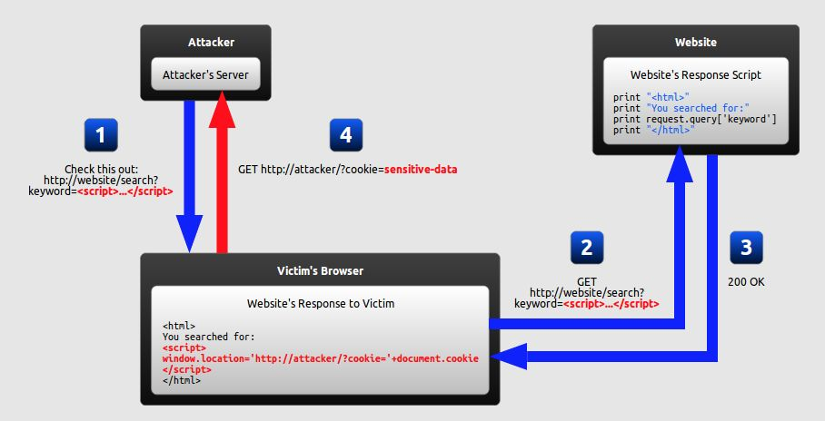
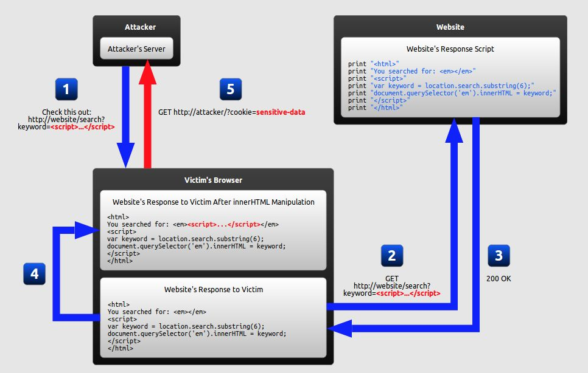
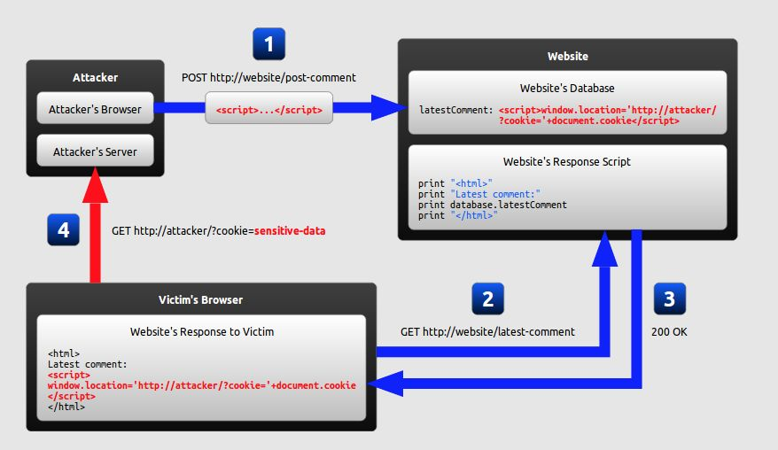

# 前端安全问题和防范

## 几种常见的攻击手段

- XSS 跨站脚本攻击

- CSRF 跨域请求伪造

## XSS

XSS（Cross-Site Scripting）又称跨站脚本，XSS 的重点不在于跨站点，而是在于脚本的执行。

XSS 是一种经常出现在 Web 应用程序中的计算机安全漏洞，是由于 Web 应用程序对用户的输入过滤不足而产生的。

常见的 XSS 攻击有 3 种：

- 反射型

- DOM-base 型

- 存储型

前两种为非持久型，存储型为持久型

### 反射型

对于访问者而言是一次性的，具体表现在我们把我们的恶意脚本通过 URL 的方式传递给了服务器，而服务器则只是不加处理的把脚本“反射”回访问者的浏览器而使访问者的浏览器执行相应的脚本。反射型 XSS 的触发有后端的参与，要避免反射性 XSS，必须需要后端的协调，后端解析前端的数据时首先做相关的字串检测和转义处理。

此类 XSS 通常出现在网站的搜索栏、用户登录口等地方，常用来窃取客户端 Cookies 或进行钓鱼欺骗。整个攻击过程大约如下：



<!-- <input class="input" placeholder="输入任意内容" ref="inputRef" @keyup.enter="handleSearch" />
<button class="button" @click="handleSearch">发起搜索</button>

<div style="margin-top: 12px;">您搜索的内容是：<div id="keyword"></div></div>

<script setup>
import { ref } from 'vue'
const inputRef = ref()
const keywordRef = ref()
const searchValue = ref("")
const handleSearch = () => {
  searchValue.value = inputRef.value.value

  var myDiv = document.getElementById('keyword');

  // 包含脚本的 HTML 代码
  const scriptHTML = inputRef.value.value;

  // 使用 innerHTML 插入 HTML 代码
  myDiv.innerHTML = scriptHTML;
}
</script>

<style scoped>
.input {
  border: solid 1px #ddd;
  border-radius: 4px;
  padding: 0 12px;
  height: 32px;
  line-height: 32px;
  width: 400px;
}
.button {
  background-color: #f2f2f2;
  margin-left: 12px;
  height: 32px;
  padding: 0 12px;
  border-radius: 4px;
}
</style> -->

### DOM-base 型

客户端的脚本程序可以动态地检查和修改页面内容，而不依赖于服务器端的数据。例如客户端如从 URL 中提取数据并在本地执行，如果用户在客户端输入的数据包含了恶意的 JavaScript 脚本，而这些脚本没有经过适当的过滤和消毒，那么应用程序就可能受到 DOM-based XSS 攻击。需要特别注意以下的用户输入源 document.URL、 location.hash、 location.search、 document.referrer 等。



### 存储型

攻击者事先将恶意代码上传或储存到漏洞服务器中，只要受害者浏览包含此恶意代码的页面就会执行恶意代码。这就意味着只要访问了这个页面的访客，都有可能会执行这段恶意脚本，因此储存型 XSS 的危害会更大。

存储型 XSS 一般出现在网站留言、评论、博客日志等交互处，恶意脚本存储到客户端或者服务端的数据库中。



### XSS 攻击的危害

攻击劫持访问；

盗用 cookie 实现无密码登录；

配合 csrf 攻击完成恶意请求；

使用 js 或 css 破坏页面正常的结构与样式等；

### XSS 的防御手段

1. HTML 编码

将不可信数据放入到 HTML 标签内（例如 div、span 等）的时候进行 HTML 编码

例如将 & < > " ' / 转义为实体字符（或者十进制、十六进制）

```js
function encodeForHTML(str, kwargs) {
  return ("" + str)
    .replace(/&/g, "&")
    .replace(/</g, "<")
    .replace(/>/g, ">")
    .replace(/"/g, '"')
    .replace(/\//g, "/");
}
```

2. Attribute 编码

将不可信数据放入 HTML 属性时（不含 src、href、style 和事件处理属性），进行 HTML Attribute 编码

除了字母数字字符以外，使用 HH;(或者可用的命名实体)格式来转义 ASCII 值小于 256 所有的字符

```js
function encodeForHTMLAttribute(str, kwargs) {
  let encoded = "";
  for (let i = 0; i < str.length; i++) {
    let ch = (hex = str[i]);
    if (!/[A-Za-z0-9]/.test(str[i]) && str.charCodeAt(i) < 256) {
      hex = "&#x" + ch.charCodeAt(0).toString(16) + ";";
    }
    encoded += hex;
  }
  return encoded;
}
```

3. JavaScript 编码

将不可信数据放入事件处理属性、JavaScirpt 值时进行 JavaScript 编码

除字母数字字符外，请使用 xHH 格式转义 ASCII 码小于 256 的所有字符

```js
function encodeForJavascript (str, kwargs) {
  let encoded = "";
  for (let i = 0; i < str.length; i++) {
    let ch = (hex = str[i]);
    if (!/[A-Za-z0-9]/.test(str[i]) && str.charCodeAt(i) < 256) {
      hex = "\x" + ch.charCodeAt(0).toString(16);
    }
    encoded += hex;
  }
  return encoded;
}
```

4. XSS 防御之 URL 编码

将不可信数据作为 URL 参数值时需要对参数进行 URL 编码

将参数值进行 encodeURIComponent 编码

```js
function encodeForUrl(str, kwargs) {
  return encodeURIComponent(str);
}
```

5. XSS 防御之 CSS 编码

将不可信数据作为 CSS 时进行 CSS 编码

除了字母数字字符以外，使用 XXXXXX 格式来转义 ASCII 值小于 256 的所有字符

```js
function encodeForCSS(attr, str, kwargs) {
  let encoded = "";
  for (let i = 0; i < str.length; i++) {
    let ch = str.charAt(i);
    if (!ch.match(/[a-zA-Z0-9]/)) {
      let hex = str.charCodeAt(i).toString(16);
      let pad = "000000".substr(hex.length);
      encode += "\\" + pad + hex;
    } else {
      encode += ch;
    }
  }
  return encode;
}
```

## 小结

在任何时候用户的输入都是不可信的。对于 HTTP 参数，理论上都要进行验证，例如某个字段是枚举类型，其就不应该出现枚举以为的值；对于不可信数据的输出要进行相应的编码；此外 httpOnly、 CSP、 X-XSS-Protection、 Secure Cookie 等也可以起到有效的防护。

XSS 漏洞有时比较难发现，所幸当下 `React`、`Vue` 等框架都从框架层面引入了 `XSS` 防御机制，一定程度上解放了我们的双手。
