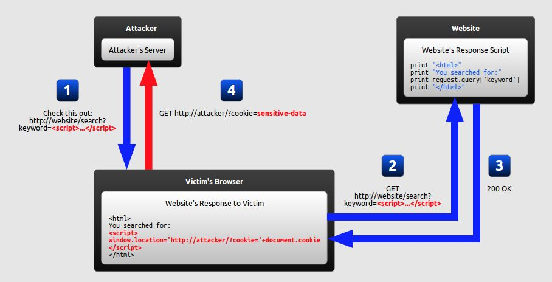
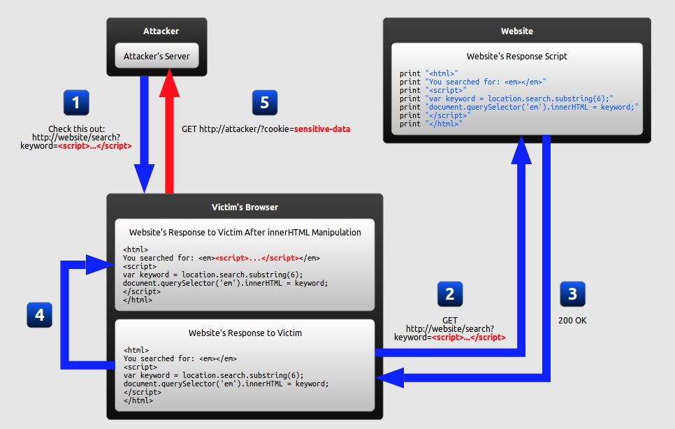
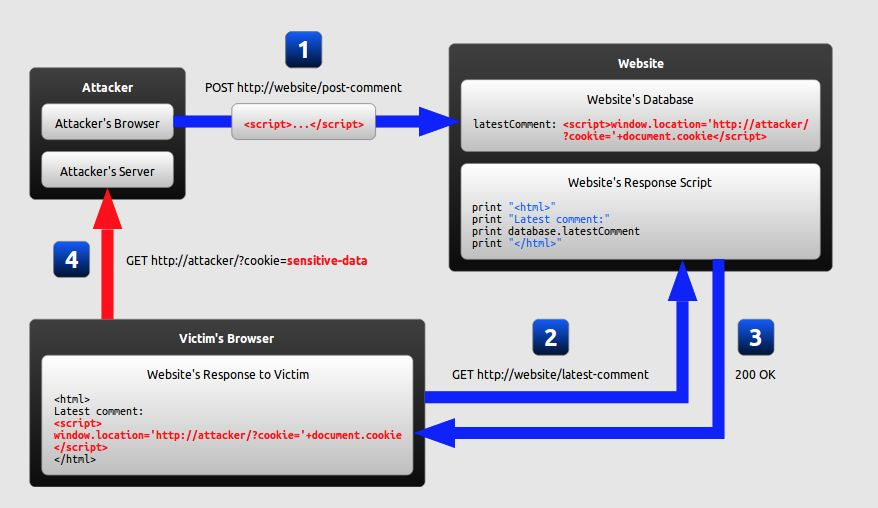

---
tags:
  - cms-import-ready
---

# 前端安全问题和防范

## 几种常见的攻击手段

- XSS 跨站脚本攻击

- CSRF 跨站请求伪造

## XSS

XSS（Cross-Site Scripting）又称跨站脚本，XSS 的重点不在于跨站点，而是在于脚本的执行。

XSS 是一种经常出现在 Web 应用程序中的计算机安全漏洞，是由于 Web 应用程序对用户的输入过滤不足而产生的。

常见的 XSS 攻击有 3 种：

- 反射型

- DOM-base 型

- 存储型

前两种为非持久型，存储型为持久型

### 反射型

对于访问者而言是一次性的，具体表现在我们把我们的恶意脚本通过 URL 的方式传递给了服务器，而服务器则只是不加处理的把脚本“反射”回访问者的浏览器而使访问者的浏览器执行相应的脚本。反射型 XSS 的触发有后端的参与，要避免反射性 XSS，必须需要后端的协调，后端解析前端的数据时首先做相关的字串检测和转义处理。

此类 XSS 通常出现在网站的搜索栏、用户登录口等地方，常用来窃取客户端 Cookies 或进行钓鱼欺骗。整个攻击过程大约如下：



### DOM-base 型

客户端的脚本程序可以动态地检查和修改页面内容，而不依赖于服务器端的数据。例如客户端如从 URL 中提取数据并在本地执行，如果用户在客户端输入的数据包含了恶意的 JavaScript 脚本，而这些脚本没有经过适当的过滤和消毒，那么应用程序就可能受到 DOM-based XSS 攻击。需要特别注意以下的用户输入源 document.URL、 location.hash、 location.search、 document.referrer 等。



### 存储型

攻击者事先将恶意代码上传或储存到漏洞服务器中，只要受害者浏览包含此恶意代码的页面就会执行恶意代码。这就意味着只要访问了这个页面的访客，都有可能会执行这段恶意脚本，因此储存型 XSS 的危害会更大。

存储型 XSS 一般出现在网站留言、评论、博客日志等交互处，恶意脚本存储到客户端或者服务端的数据库中。



### XSS 攻击的危害

攻击劫持访问；

盗用 cookie 实现无密码登录；

配合 csrf 攻击完成恶意请求；

使用 js 或 css 破坏页面正常的结构与样式等；

### XSS 的防御手段

1. HTML 文本内容

把不可信数据作为文本插入 DOM 时，优先使用 `textContent`。如果确实需要将文本拼入 HTML 字符串，再按 HTML 文本上下文编码；不同上下文不能共用同一套编码规则。

```js
function encodeForHTML(value) {
  const entities = {
    '&': '&amp;',
    '<': '&lt;',
    '>': '&gt;',
    '"': '&quot;',
    "'": '&#39;',
  }
  return String(value).replace(/[&<>"']/g, (char) => entities[char])
}

// 只需显示纯文本时，直接使用：target.textContent = userInput
```

2. HTML 属性

使用固定名称的普通属性和 DOM API 设置值，例如 `title`。不要把不可信数据直接拼接进 HTML 属性字符串；`href`、`src`、`style` 和事件处理属性还需要分别处理 URL、CSS 或脚本执行风险。

```js
target.setAttribute('title', userInput)
```

3. JavaScript 上下文

不要把不可信数据拼接进内联脚本、事件处理属性或 `eval` 等动态执行入口。通过事件监听器传递数据，或将数据放入安全的文本节点与普通属性；确需在 HTML 中嵌入脚本数据时，应使用成熟的上下文编码方案。

```js
button.addEventListener('click', () => {
  target.textContent = userInput
})
```

4. URL 参数

将不可信数据作为 URL 参数值时，用 `URLSearchParams` 或 `encodeURIComponent` 编码参数值。如果整个 URL 来自用户，还必须校验协议和目标，不能仅靠 URL 编码阻止 `javascript:` 等危险地址。

```js
const url = new URL('/search', location.origin)
url.searchParams.set('keyword', userInput)
```

5. CSS 值

避免直接拼接 `<style>` 或 `style` 字符串。若必须让用户控制某个样式值，可使用固定属性与白名单值。

```js
const allowedColors = new Set(['red', 'blue', 'black'])
target.style.color = allowedColors.has(userInput) ? userInput : 'black'
```

## 小结

在任何时候用户的输入都是不可信的。服务端应验证 HTTP 参数；输出时要按最终使用的上下文处理不可信数据。`HttpOnly` Cookie 和 CSP 可提供额外防护，但不能代替安全的输出处理。`X-XSS-Protection` 已过时，不应依赖它防御 XSS。

React、Vue 默认会对普通文本插值进行安全处理，但直接写入原始 HTML（如 `dangerouslySetInnerHTML`、`v-html`）仍需先处理不可信内容。
