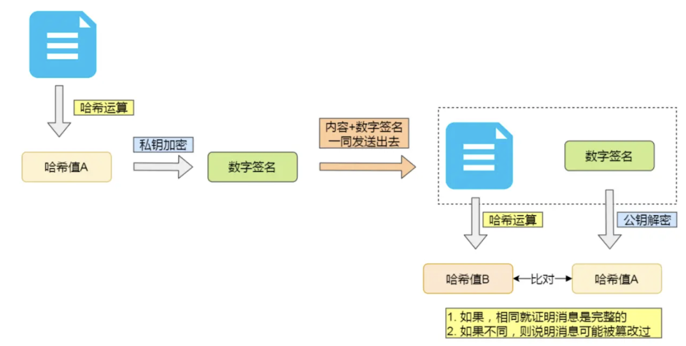

# HTTP 特性整理

到目前为止，HTTP 常⻅到版本有 HTTP/1.1，HTTP/2.0，HTTP/3.0，不同版本的 HTTP 特性 是不一样的。

## HTTP 1.1 特点

简单、灵活和易于扩展、应用广泛和跨平台。

1. 简单

HTTP 基本的报文格式就是 header + body ，头部信息也是 key-value 简单文本的形式， 易于理解，降低了学习和使用的⻔槛。

2. 灵活和易于扩展

HTTP 协议里的各类请求方法、URI/URL、状态码、头字段等每个组成要求都没有被固定死，都允许开发人员自定义和扩充。

HTTP 在应用层工作，因此它的下层可以随意变化。例如：

- HTTPS 就是在 HTTP 与 TCP 层之间增加了 SSL/TLS 安全传输层;

- HTTP/1.1 和 HTTP/2.0 传输协议使用的是 TCP 协议，而到了 HTTP/3.0 传输协议改用了 UDP 协议。

3. 应用广泛和跨平台

互联网发展至今，HTTP 的应用范围非常的广泛，从台式机的浏览器到手机上的各种 APP， 从看新闻、刷贴吧到购物、理财、网游，HTTP 的应用遍地开花，同时天然具有跨平台的优越性。

当然也有一些缺点：无状态、明文传输、不安全

相对应的解决方案：

无状态：cookie、token

明文传输：https

不安全：https

## HTTP 的性能问题

HTTP 1.1 进行了一些性能优化

1. 长连接（持久连接）

3 次握手后，可以建立长连接，

只要任意一端没有明确提出断开连接，则保持 TCP 连接状态。

因此有 4 次挥手断开连接的概念。

2. 管道网络传输

在同一个 TCP 连接里面，客户端可以发起多个请求，只要第一个请求发出去了，不必等 其回来，就可以发第二个请求出去，可以**减少整体的响应时间**。

这种方式解决了请求的队头阻塞，但是没有解决响应的队头阻塞。

## HTTPS

### 概念

HTTPS 就是在 TCP 和 HTTP 网络层之间加上一层 SSL/TLS 协议层。

HTTP 连接建立相对简单， TCP 三次握手之后便可进行 HTTP 的报文传输。而 HTTPS 在 TCP 三次握手之后，还需进行 SSL/TLS 的握手过程，才可进入加密报文传输。

HTTP 默认端口为 80，而 HTTPS 默认端口为 443。

HTTPS 协议需要向 CA(证书权威机构)申请数字证书，来保证服务器的身份是可信的。

HTTPS 解决了 HTTP3 大风险：

1. 窃听风险

2. 篡改风险

3. 冒充风险

### HTTPS 的特点：

1. HTTPS 采用了**对称加密**和**非对称加密**结合的混合加密方式。

2. 摘要算法+数字签名

为了保证传输的内容不被篡改，我们需要对内容计算出一个「指纹」，然后同内容一起传输
给对方。

对方收到后，先是对内容也计算出一个「指纹」，然后跟发送方发送的「指纹」做一个比 较，如果「指纹」相同，说明内容没有被篡改，否则就可以判断出内容被篡改了。

3. 数字证书

在计算机里，权威的机构就是 CA (数字证书认证机构)，将服务器公钥放在数字证书 (由数字证书认证机构颁发)中，只要证书是可信的，公钥就是可信的。

### HTTPS 建立连接的过程

SSL/TLS 协议基本流程:

1. 客户端向服务器索要并验证服务器的公钥

2. 双方协商生产「会话秘钥」

3. 双方采用「会话秘钥」进行加密通信
