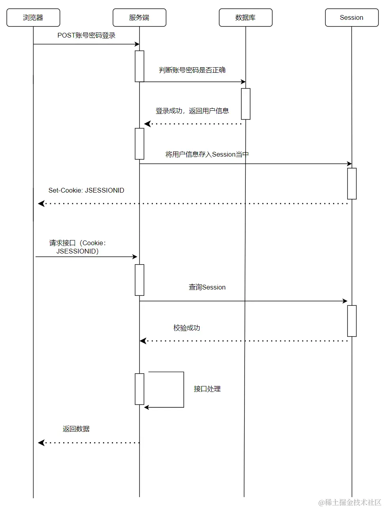

# cookie 相关

http 是无状态协议，因此请求头中的 cookie 字段就是服务端识别客户端的身份用的。

cookie 生成的流程如下：

- 浏览器向服务端发出 http 请求

- 服务端响应请求，并且响应头带上 Set-Cookie 字段

- 浏览器识别到 Set-Cookie 字段，**自动**保存起来

- 接下来的**一段时间**内，浏览器对该服务端的请求都会自动带上 Cookie 请求头

## cookie 的组成

cookie 本身是一系列键值对生成的字符串，形如 a=xxx; b=xxx;携带了需要告诉服务端的验证信息。

在这些信息中有几个关系到 cookie 的生命周期和使用方式：

- `Max-Age`: 相对时间，浏览器根据当前系统时间自动计算截止日期（优先级更高）

- `Expires`: 截止日期，是过期的绝对时间

- `Domain`: 域名，指定了这条 cookie 所属的域名

- `Path`: 路径，指定了这条 cookie 所属的路径

其中`Domain`和`Path`都可以设置多条，让浏览器自行匹配，两者互不干扰

## cookie 的安全性

cookie 是可以通过`document.cookie = xxx`修改的，因此浏览器为了不让恶意脚本篡改，提供了以下几个属性

- `HttpOnly`: 声明此 cookie 只能通过 http 协议访问，不允许其它方式访问（这种情况 js 调用则会报错）

- `SameSite`:

  - 设置`SameSite=Strict`可以严格限定 cookie 不能随着跳转链接跨站发送

  - 设置`SameSite=Lax`则宽松一点，允许`GET`, `HEAD`类型的请求发送，但是禁止`POST`

- `Secure`: 表示这个 Cookie 仅能用 HTTPS 协议加密发送，但是浏览器里还是明文保存

## cookie 的应用场景

1. 广告跟踪

服务端通常会用 cookie 来追踪用户，比如防止用户反复看到同一条广告

2. 自动登录

session 的储存方式通常是以下几种：

- `Redis`: 内存型数据库，访问快

- `内存`: 直接放到变量里，服务重启了数据就会消失

- `数据库`: 普通数据库，性能不高

## 拓展：分布式下 session 不共享的问题

:::
问题描述： 服务部署到多台设备上，用户请求过来做了负载均衡，如果后续请求的设备和之前不一致，或者机器宕机，session 就会失效。
:::

解决方案：

- 储存角度: 把 session 集中储存，所有机器统一到这台服务器或者数据库上获取 session

- 分布角度: 让相同 IP 的请求始终命中同一台设备（相当于阉割了负载均衡）

- 其它方案: session 复制、第三方储存
