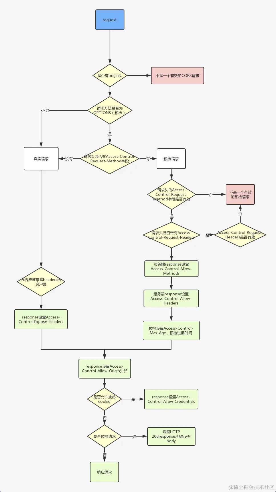

# 同源策略和跨域处理

在浏览器中，内容是很开放的，任何资源都可以接入其中，如 JavaScript 文件、图片、音频、视频等资源，甚至可以下载其他站点的可执行文件。

但也不是说浏览器就是完全自由的，如果不加以控制，就会出现一些不可控的局面，例如会出现一些安全问题，如：

跨站脚本攻击（XSS）

跨站请求伪造（CSRF）

SQL 注入攻击

OS 命令注入攻击

HTTP 首部注入攻击

因此，浏览器通过同源策略来解决这个问题

## 同源策略

它用于限制一个源的文档或者它加载的脚本与另一个域的资源进行交互。

如果两个 url 的**协议**、**主机**、**端口**都相同，我们就称这两个 url 同源。

同源策略限制了以下几方面：

- DOM 访问限制，例如无法访问到不同源的 iframe 和页面选项卡的信息

- Web API 限制，限制了 JavaScript 从其它源加载 web 数据（XHR 和 Fetch API）

- 网络通信限制，阻止一个源发送的请求获取其它源的响应

浏览器的拦截在以下 2 种情况都有可能发生

1. 调用请求 API 被浏览器拦截

2. 浏览器已经获取到响应数据，但是发现它与同源策略冲突，于是阻止网页获取到这个数据

## CORS

CORS 指的是跨源资源共享，是一种机制，允许在受控情况下让不同源的网页能够请求和共享资源。

CORS 的基本思想是，服务器在响应首部提供几个字段，指定哪些源被允许访问。

浏览器在发起跨域请求时会先发送一个预检请求（OPTIONS）到服务器，服务器通过设置适当的 CORS 首部来指定是否允许跨域。

一旦服务器通过了预检请求，那么以后浏览器正常的 CORS 请求就不会再发送预检请求，而是和简单请求一样处理。

常见的 CORS 字段：

Access-Control-Allow-Origin

Access-Control-Allow-Headers

Access-Control-Allow-Methods

## 简单请求

不会触发 CORS 预检的请求为简单请求，需要满足下述所有条件

1. 请求方法：GET、HEAD、POST

2. 请求首部：Accept、Accept-Language、Content-Language、Last-Event-ID、Content-Type（仅限于 application/x-www-form-urlencoded、multipart/form-data、text/plain，其它字段不再视为简单请求

3. 请求中没有使用 ReadableStream 对象

4. 请求头不包含用户自定义的字段

5. 请求中的任意 XMLHttpRequestUpload 对象均没有注册任何事件监听器（XMLHttpRequestUpload 对象可以使用 XMLHttpRequest.upload 属性访问）

## 绕过跨域限制的一些手段

1. jsonp: 通过 script 标签 src 请求资源，需要资源符合一定格式

2. 服务器中转：浏览器将接口请求发往代理服务器，由代理服务器来请求目标服务器，就可以绕过浏览器限制，但是部分情况处理起来比较复杂，例如 cookie 穿透；另外，代理服务器由于不是浏览器发起的请求，类似于接口爬虫，容易被目标服务器检测到。
