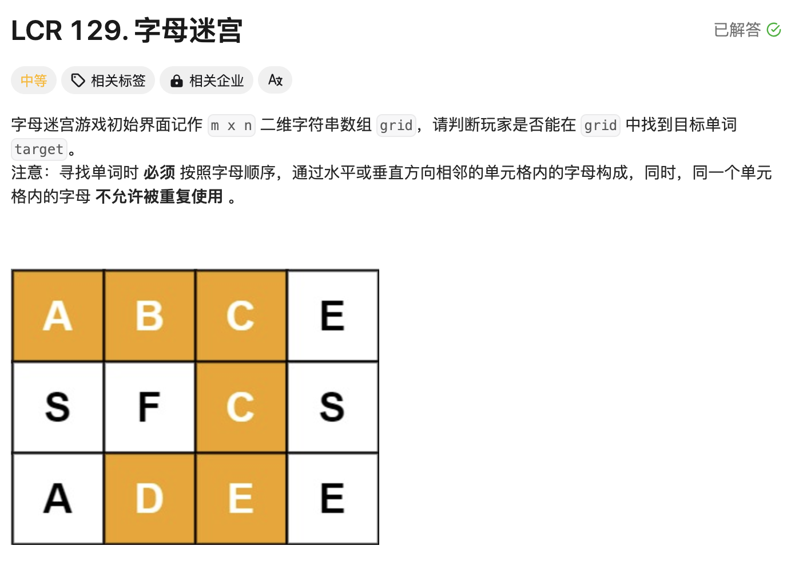

# 12 月前端面试复盘

:::
最近离职后开启了复习和面试模式，这里记录一下面试问到的问题
:::

## 字节跳动飞书一面（通过）

### 自我介绍+聊项目 (10min)

#### 低代码平台如何解决源码更新的发版问题

- 通过操作规范和 CICD 约束流程，发 npm 包->更新渲染器->升级运行态应用->更新物料

#### 低代码平台适用于公司的哪些业务

- PC：重复的表单表格业务

- 移动端：轻交互轻逻辑的小程序页面（海报, 营销活动, 问卷表单）

#### 如何理解在低代码平台分发后在几条业务线并行开发

- 项目通过镜像的方式发布应用市场，持续提供版本号给各个业务线，同时业务线也在使用过程中提 PR

- 平台支持业务线接入自己的组件库，渲染引擎提供主流程的能力，方便横向扩展应用能力

（面试官更关心项目发版和更新的流程）

### 技术问题 (30min)

#### JS 的类型和区别

- 基本类型

- 引用类型

- 栈内存和堆内存

#### JS 的不同类型在函数里面调用时区别

- 函数上下文

- 形参和实参的关系

#### let 和 var 的区别

- 块级作用域（词法环境）

- 变量提升

#### 追问：哪些情况会发生上下文的提升

- 函数和变量的提升，以及提升范围

#### 追问：function 和 var 发生提升的优先级哪个更高

- 函数和变量提升方式的差异

#### 如何理解闭包

- 函数上下文

- 模块化，自由变量

- GC

#### 追问：函数作用域是什么时候创建的

- 定义时创建

- JS 的词法环境

#### 有没有了解过 CDN

- DNS 的代理和递归

- 分布式和负载均衡

- 浏览器缓存

#### 说一下重绘和回流

- 浏览器的渲染过程

- CSS 属性发生作用的不同阶段

#### 追问：什么情况触发回流，回流的的影响范围

- 触发回流的条件：style 更改了布局属性、js 访问了模型布局属性

#### 说一下对 BFC 的了解

- 浏览器的布局原理

- 块级格式化上下文的创建条件

#### CSS 选择器的优先级，在项目中如何避免选择器的冲突

- CSS 样式的计算过程，层叠规范（id>class>media query>:伪类>类型）

- CSS 的一些架构规范：例如 SMACSS、Module、ACSS

#### 浏览器的储存方式有哪些

- 联系到浏览器 API，4 种常见的储存方式，需要说出区别

#### 说一下接口的缓存方式

#### 有没有了解过 BOM

- 基本上在浏览器上不属于 EcmaScript 规范的都是跟 BOM 相关的 API

- 需要说出常见浏览器对象和 API

- 对象：window, navigator, screen, history, location, FileReader, XMLHttpRequest, IntersectionObserver, MutationObserver, Worker

- API：postMessage、fetch

### 手写代码 (20min)

#### Promise 和 async/await、setTimeout 混写的代码，写出输出结果

#### 二叉树的蛇形遍历

- 思路：层序遍历 + 打印结果按 flag 状态进行一个交替输出

#### 封装一个发布订阅事件处理器，实现 on、off、once、emit

就是关于事件队列的维护，但是我准备的时候没有考虑到一种**复杂**的情况：

```js
let fn = () => {
  console.log(1)
}
event.once('event1', fn)
event.off('event1', fn)
event.emit('event1') // 无输出
```

由于 once 是借助闭包封装了一个新的函数，事件队列里面记录的是新函数的指针

导致调用 off 的时候传原函数是找不到的，也就没法清空

这里提供 2 个思路

1. once 的时候直接用新的函数覆盖原函数指针（但我觉得这种方式不好，因为影响了原来的函数，有副作用）

2. once 的时候给 fn 加一个属性，指向重新创建的代理函数，这样就可以在 off 的时候把代理函数也干掉（更优，加属性影响范围很小，甚至加的属性可以用 symbol 和业务避免冲突）

---

## 字节跳动飞书二面（卒）

### 自我介绍+聊项目（30min）

#### 做低代码平台的时候有没有参考其它公司的开源项目，比如阿里的低代码引擎，他的**协议**设计和你们的差异是什么

- 确实是没有深入了解，因为规范是架构师定的，要求我们要自研，满足自身的业务需要

- 回答方向上应该从优先满足业务的角度考虑，另外确实要参考一下开源项目的方案

  - 1. 因为低代码平台还包括了后端的物料，需要同时兼容后端的物料格式

  - 2. 需要承接已有的物料格式

  - 3. 我们的低代码平台没有阿里的复杂，物料格式上需要进行简化

  - 4. 需要满足自身的业务需求，例如无限嵌套，因此在协议上需要有自主权

#### 介绍一下物料的数据**协议**和页面的数据**协议**如何设计的

- 物料：基本信息（编码、来源：源码 or 低码） + 配置信息（表单 dsl） + 默认属性

- 页面：

  - 容器信息：页面名称、页面版本、变量字典（默认值用 json string）、物料字典（页面用到的组件的编码+来源）

  - 元素信息：基本信息（编码、uid、索引、版本） + 组件属性

#### 为什么不使用开源项目的设计规范，而是选择自己定义

- 业务需要，但是有参考开源项目的设计思路

#### 如何解决多人同时编辑的冲突问题，比如动态代码编译后变成一行后，多人同时修改的冲突

- 业务方案：1. 编辑锁；2. 页面拆小模块，对应的人改对应的模块，模块通过后端拼凑成页面

- 技术方案：后端进行 JSON diff，可以解决增、删、移动问题，但是具体到行改动的问题只能后面覆盖前面

#### 展示组件能否实现嵌套

- 组件划分：嵌套只能由容器组件提供

- 需求实现：对于场景上的需要（封装卡片组件，标题+内容），由自定义组件提供插槽

#### 如何通过容器组件和展示组件实现一个列表

- 考虑到了这个问题，提供了列表容器按数据源循环出子容器，接收展示组件，循环渲染出来

- 列表子组件的数据接收是通过定义 dsl 获取容器循环的执行上下文

#### 低代码渲染器前端的性能问题如何解决

- 分阶段考虑问题

  - 1. 请求阶段：

    - 可以通过 JSON 的压缩算法减少体积(json-pack)

    - 可以通过版本号和客户端储存的方式提高二次进入的加载速度

  - 2. 渲染阶段：

    - 可以通过时间分片(requestIdleCallback)，让组件分批次地出来，类似于懒加载，同时不阻塞交互。

    - 组件分批次的依据，可以在编辑器保存时事先分组，并将分组信息保存到数据上，因为组件已经渲染出来了，知道位置。（也可以借助服务端调无头浏览器自动化分组，反正生成截图的时候都要用到的）

- 其它角度

  - 1. 骨架屏（也可以通过编辑器或服务端生成）

  - 2. 减少节点数量的思路，对于很复杂的组件，考虑用一个大组件写源码实现，从而减少渲染器的负担。

#### 表单项的关联更新和隐藏是如何设计的

- 我们的方案是在单个表单项通过 mutex（互斥）的编排（定义 id 和互斥逻辑），定义表单项之间的关系，把互斥的表单项从表单的 UI 和数据中都剔除掉。

#### 动态代码的线上问题如何定位和排查

- 1. 给动态代码的调用入口增加了 try catch，可以精准定位错误位置，甚至可以 debug

- 2. 小程序提供了简易的动作编排配置，本质还是走源码逻辑，不会提供动态代码的方案

#### 说一下变量管理为什么不使用 React 的 state，而是自己做依赖收集

- 1. 我们定义的变量是挂载到容器上的，而不是变量上的，实际上还是利用了 state，但是 state 会通过 context 传递到每一个组件上，导致了每次状态的变更都会触发全量的重渲染

- 2. 出于性能优化的需要，我们需要建立组件属性和容器状态的关联，进行细粒度更新

- 3. 依赖收集的方式和 Vue3 类似，是发布订阅的设计模式，跟踪到具体状态的变化通知对应的组件更新

#### 如何实现组件的动态化，属性随着接口数据变化

- 我们的框架是重运行时的，编辑器的编排就是为了定义变量、接口和组件的关联

- 在编辑器上，定义接口的响应关联到变量 key 上

- 变量更新驱动了视图的更新

（面试官更关心项目的选型依据，以及业务问题的思考方向和解决思路）

### 手写代码（20min）

#### 走二维迷宫，根据随机的起点和终点判断有没有解

原题是二维数组中有 0 和 1 组成的迷宫，1 是墙，随机给起点和终点判断能不能走出去，例如

[
[0, 1, 0, 1]
[0, 1, 0, 0]
[0, 1, 1, 0]
[0, 0, 0, 0]
]
起点：[0, 0]，终点：[0, 3]

我在 leetcode 没有找到一样的，但是有一道类似的



这是一道 dfs 的算法题，但是其实还多了回溯过程，这是我当时通过迭代法只做了暴力解法

没有考虑到回溯去优化，这里通过这道题复盘一下

```js
/**
 * @param {character[][]} grid
 * @param {string} target
 * @return {boolean}
 */
const wordPuzzle = function (grid, target) {
  let rows = grid.length
  let cols = grid[0].length
  const dfs = (i, j, k) => {
    // 终止条件1：越界了或者不等于目标值
    // 这里最后一个判断很关键【我面试的时候未考虑到】，就是即使走对了，也会把grid[i][j]改成\0，从而让条件false，从而避免了走重复的路径，保证前进的方向始终是不重复的
    if (i >= rows || i < 0 || j >= cols || j < 0 || grid[i][j] !== target[k])
      return false
    // 终止条件2：成功走到了终点
    if (k === target.length - 1) return true
    // 记录走过的路径
    grid[i][j] = '\0'
    // 按右，左，上，下的顺序开始走迷宫
    let res =
      dfs(i + 1, j, k + 1) ||
      dfs(i - 1, j, k + 1) ||
      dfs(i, j + 1, k + 1) ||
      dfs(i, j - 1, k + 1)
    // 不管命中了true还是false，都记录一下当前的路径
    grid[i][j] = target[k]
    return res
  }
  for (let i = 0; i < rows; i++) {
    for (let j = 0; j < cols; j++) {
      // 遍历所有的格子，开始走迷宫
      // dfs一直「递」到终点然后走「归」的流程让结果冒泡到这里
      if (dfs(i, j, 0)) {
        return true
      }
    }
  }
  return false
}
```

### 开放性问题（10min）

（开放题我没怎么准备，同时也因为时间关系，最后十分钟没聊好 😭）

#### 有没有关注一些新技术

- 提到了最近比较关注 SSR 和 CSR

- 一时没想起来的：monorepo、esbuild、PWA、electron、threejs-xr

- 我所了解的前端的趋势：

  - PWA 的回归（现在后管项目动辄几十 M，后管可以提供 PWA 的方式，借助本地离线包，提高用户的加载体验），safari 和 chrome 都提供了这种形式，达到接近原生桌面端应用的体验

  - 随着 Node.js 的发展，前后端的界限可能会被重新抹平（Vue 和 React 都有推 SSR 专用模块），从而让前端在服务端渲染阶段通过 SQL 直接获取数据。所以前端也需要学习数据库

  - 随着浏览器进一步开放 wasm 和 worker，性能会得到极大的提升，JS 单线程的性能瓶颈会得到较大的释放，社区有传言 React 想用 Rust 重构 Fiber 模块。

  - 随着增强现实（XR）技术的发展，未来 threejs 可能是一个大方向，网页可能会以 3d 的方式渲染，交互方式和布局方式都会发生比较大的变革，不再受画布边界的限制。希望学习一下 threejs 和 threejs-xr

#### 最近在研究什么技术，以及学习的方式

- 正在学习 tdd 的思路，并且通过这种思路去实现一些框架的主流程，从而训练自己的思维

- 学习的方式：官方文档、掘金优质文章、字节前端公众号、github 源码

#### 在以前的公司有没有开展什么技术分享

- 有组织技术分享，担任主讲，手撕框架源码

- 有沉淀技术文档和开发文档

---

## 豌豆思维一面（通过）

### 自我介绍+聊项目（20min）

...略过重复问题

#### 低代码页面的性能优化怎么做的，有什么判定指标，如何监控

[网页性能优化指标](../frontend/浏览器/网页性能优化指标.md)

（整体感觉：面试官更注重项目的性能和发版流程）

### 技术问题（10min）

#### package-lock 的作用

- 是什么：npm 装依赖自动生成的文件，用于确保在不同的环境中安装相同版本的依赖包，以保持项目的一致性

- 具体流程：

  - 1. 符合范围，以锁死的版本号为主

  - 2. 不符合范围，将按 package.json 的版本安装，并覆盖 lock 配置

#### 追问：什么情况下不能锁定版本

- 场景举例：

  - 1. 持续集成或持续交付环境，希望**始终使用最新**的稳定版包依赖

  - 2. 多人协作场景，团队成员的系统环境和 Node 环境不一样，锁定版本可能会导致冲突

  - 3. 需要降低依赖版本的场景，locked 文件可能会阻止这样的调整

  - 4. 信任包作者，希望让包依赖获取最新的支持

- 防止锁定的方式：

  - 1. `install`的时候加上`--no-lockfile`可以防止生成 lock 文件

  - 2. 加到`.gitignore`防止提交

- 危害：

  - 可能会导致不同环境安装的依赖版本不一致，依赖本身导致的 bug 不好排查

#### package.json 的 scripts 运行脚本和 node 运行脚本有什么区别

- 运行环境的区别：package.json 的 script 在项目上下文中执行，node 命令在系统环境运行（不会考虑项目依赖关系）

- 依赖管理的区别：script 脚本可以直接使用 node_modules 的依赖，node 只能使用全局依赖

- 命令的命名和管理：script 可以更好地约定项目命令，node 则每次都需要手敲

#### node 文件中执行 require 会发生什么

- 1. 查找模块

  - 先找核心模块：例如 fs、http

  - 再找路径模块，按绝对路径或相对路径找

  - 第三方模块，沿着文件路径向上逐级找 node_modules 目录（每层都会看有没有 node_modules）

  - NODE_PATH 环境变量

- 2. 加载模块

  - 一旦找到模块文件，Node 会将文件加载到内存中，如果是 js 文件，会被解释执行，如果是 JSON 文件，会被解析为对象，如果是二进制模块，会被直接加载

- 3. 缓存模块

  - Node 会缓存 require 过的模块，以便在后序 require 中直接返回缓存的模块，确保模块只会被加载一次，变量也不会重复创建。

- 4. 返回模块结果

  - require 的结果是加载模块的结果，可以是对象、函数、类、或者其他可到处的项，具体取决于被加载模块的内容

#### 你们项目的 http 缓存采用什么策略

- 文件指纹

- 强缓存和协商缓存，尽量使用协商缓存

- 版本号路径（类似于指纹）

- 服务端配置缓存策略

### 反问（5min）

#### 项目上会有哪些挑战

- 涉及的技术栈比较多，React、Vue、Eletron，也有低代码平台

#### 开发节奏怎么样

- 看业务线，有些业务线是按迭代的，有些是分配任务的

#### 团队氛围怎么样

- 前端团队有 12 个人，会定期组织代码 review 和技术分享（每月 2 次）

---

## 豌豆思维二面（通过）

整体聊下来感觉挺不错的，面试官很随和，没有 pua

### 自我介绍+聊项目

略过重复问题...

#### 项目上做了哪些体验上的优化

- 通过自定义组件的定制配置，隔离了开发者和运营者的可控范围

- 限制了运营者界面的可控操作，简化整体流程

#### 低代码的页面发布到生产环境的流程是怎样的

- 首先编辑完之后可以通过我们提供的二维码和 url 进行预览

- 【1】未搭建的页面可以保存为草稿

- 【2】保存后进入页面库，但是处于预发布的状态

- 【3】需要在列表上点击发布按钮，才会最终去到线上

#### 前端的错误监控体系怎么做的

- 通过 ReactErrorBoundary 埋点，同时隐藏掉报错的模块，把影响范围降到最小

- 同时组件出现了问题也可以把在页面上把组件回滚到上一个版本，或者页面整体回滚到上一个版本先进行上线

- 把错误信息通过接口进行上报（包含了出错的页面信息）

- 后端通过钉钉机器人在支撑群里报警

#### 低代码项目如果线上出了问题，说一下你们从排查到修复的流程

- 通过钉钉机器人得到的报警信息或者测试的信息，包含了页面 json 数据、版本信息和应用信息

- 前端值班人员根据 json 数据本地 mock 出错误情况进行分析、修复和上线

- 项目发版后将更新版本号和 bug 信息通知到对应的人员（最快半小时内）

#### 你们团队有多少个人在做这个项目

- 4 个人，我主要负责低代码平台的主流程，其他人配合写一些插件和 UI 组件

- 低代码组件和业务组件的开发会分发到对应业务线的同学进行开发，我们会进行相应的培训

#### 项目上遇到最大的挑战是什么

- 技术挑战：编辑器和表单的性能优化

- 管理挑战：推动业务线去使用低代码平台

（整体感觉：面试官更注重项目的用户体验和稳定性，侧重监控体系和性能指标，其实大部分问题和一面重复）

### 反问

#### 团队是只关注业务还是会有前端基建和技术创新

- 有基础设施团队

- 会根据各个业务线擅长的领域安排抽象一些通用模块和组件

#### 项目开发节奏怎么样，是否一直在追赶上线

- 会根据公司需求安排工作，有时候闲有时候忙

---

## 百澳家庭互动一面（通过）

### 自我介绍

### 技术问题

#### pm2 怎么同时启动多个服务，能不能做负载均衡

- 可以启动多个服务，通过-i 或者配置启动配置文件去设置进程数量

- 可以做负载均衡，通过 cluster 模式开启的多进程支持负载均衡，它默认使用轮询策略，将每个请求按顺序分配给 worker 进程，而不考虑每个 worker 的实际负载。

- 此外 pm2 也提供了配置选项自定义负载均衡的策略，例如配置 cluster 模块的 clusterMode，在多个 cpu 核心之间进行负载均衡；

- cluster 的策略就是主传子，从而实现不同的进程监听同一个端口（主进程监听端口，子进程监听主进程的 http 服务）

- 或者使用 max_memory_restart 选项根据内存使用情况进行负载均衡。

- pm2 还能做哪些事情：监听文件变化自动重启，性能监控，负载均衡，程序崩溃自动重启，还可以用于自动化部署项目

#### pm2 开启多进程的实现原理

- 本质上是通过 cluster 模块开启多进程，通过 IPC 的方式在多进程间进行通信。

- node 有几个模块可以开启多进程：

  - `thread_worker`

  - `cluster`(集群)

    - 用于创建多个 Node.js 进程，这些进程共享一个端口，可以实现负载均衡

    - 主进程监听连接，根据一定的策略分配给子进程

  - `child_process`（子进程）

    - `spawn`: 创建独立子进程，可以执行 shell

    - `fork`: 原理也是借助 spawn，特点是默认使用 node 执行

    - `execFile`: 执行文件收集结果最终得到 buffer 数据

    - `exec`: 会产生命令行，性能稍低

- child_process 更适合执行外部命令，cluster 更适合并行多个 Node 服务提高性能

- 可以挖得再深一点，除了 node 本身的特性之外还有哪些方式

  - `Docker Swarm`: Docker 官方的容器编排，不同于`Docker Compose`支持单一服务器主机创建多容器的方式，Docker Swarm 可以在多个服务器创建容器集群服务，更适合微服务的部署。Swarm 会根据指定的策略来计算最适合运行容器的节点。例如 Random（随机）、Spread（选择容器最少的节点）、Binpack（尽量集中，避免容器碎片化）

  - `k8s`: 使用集群来组织服务器，和 Docker Swarm 类似，可以设置 pod 副本数量的方式启动多进程。

#### 对 serverless 的理解

- 无服务器架构，开发者关注应用本身

- 事件驱动+函数即服务

- 支持多种编程语言

- 云服务提供商：AWS,Google cloud functions

- 适用于许多应用场景，尤其是那些有着不断变化的工作负载、需求弹性伸缩、短暂执行时间的任务等情况

#### 对 DDD 的理解

- Domain-Driven Design：领域驱动设计，是一种软件设计方法

- 例如电商网站：

- **领域**：商品、用户、订单，每个方面都有各自的规则和特点

- **模型**：需要建立一个模型，来把这些业务映射成计算机能理解的代码，比如创建表示商品的类或属性

- **战略设计**：在电商业务中可能有很多的子系统，比如商品管理、用户管理，战略设计能帮助我们划分这些子系统，确保他们的独立和协同

- **战术设计**：每个子系统内部需要考虑具体的实现，例如购物车、订单的流转，涉及到具体的业务实现

- **模式**：领域驱动设计引入了通用的设计模式，比如聚合，把商品和他的库存信息、评价信息组合成一个整体，更方便读取、管理和操作。

- **持续演进**：领域驱动设计强调持续的沟通和调整，确保系统能适应变化

- 通过领域驱动设计，我们可以更清晰地理解业务，有针对性地构建如软件系统，从而提高系统的质量和可维护性

#### 二分查找的时间复杂度是多少，怎么计算出来

- 时间复杂度是 O(logN)

- 每次迭代，搜索范围都会缩小一半，最坏的情况下，我们需要经过 log2_N 次迭代

#### 贪心算法和动态规划的时间复杂度有什么区别

- 贪心算法：通常是 O(N)，因为每步都能做出局部最优选择，不考虑之前选择对后续的影响，主要集中在一系列单步的选择上

- 动态规划：通常是 O(N^2)或 O(N^3)，因为动态规划本质上其实是递归，相当于填写了一个表格，表格的规模与问题大小相关

#### JS 能调用 GC 吗

- 这面试官喜欢挖坑

- JS 引擎中的 GC 过程的是自动进行的，不需要开发者介入，使用的是标记清除算法

- 但是开发者可以通过一些操作把标记移除掉，比如变量指针设为 null，或者 removeEventListere, clearTimeout 之类的，从而让内存资源在下一轮 GC 中释放

#### 追问：JS 执行 var a = null 会立即释放内存吗

- 又给我挖坑

- GC 的时间是不确定的，JS 会周期性地执行 GC，具体时间点和频率由内部实现，且无法通过 js 强制触发

#### 内存泄露问题怎么排查

- 开发者工具 Memory 面板查看 Heap SnapShot 分析快照

- 使用第三方包内存分析工具，比如 memory-stats.js

#### 前端性能优化在网络层有什么手段

（磕磕绊绊全都达到了，漏了个 CDN）

主要是需要从全局角度考虑，不仅前端

- 压缩资源

- CDN

- 合并和缓存

- 懒加载和预加载

- 使用 http2 和 http3

- 优化网络请求（减少请求次数，雪碧图）

- 异步加载脚本：async 和 defer

#### 前端场景中有哪些链表结构

- DOM 节点列表

- LRU 缓存算法

- 动画队列

- 事件循环的任务队列

#### XSS 攻击怎么防范

- 验证、转义和过滤

- 禁用内联脚本、白名单

- 编码和解码，encodeURIComponent

- cookie 加上 httpOnly 和 same site 和 secure

- http 头加上 Content-Security-Policy，这样就可以禁用内联脚本，对已混淆加密的脚本起到一定程度的防范作用

```html
<!-- 在 HTTP 头中设置 Content-Security-Policy -->
<meta http-equiv="Content-Security-Policy" content="script-src 'self';" />
```

#### 使用 docker 容器化部署前端应用的好处

- 环境一致性，确保在开发、测试、生产环境运行相同的容器和配置

- 依赖隔离，docker 将应用和依赖打包到一个容器中形成隔离单元，避免依赖冲突或者版本不一致的问题

- 方便部署，提供了简单一致的部署模型，减少了配置和部署的复杂性，也**方便迁移**

- 快速部署和弹性伸缩，docker 容器可以在几秒内启动，更适用于服务集群化和快速扩容的需要

- 资源有效利用，允许单主机运行多容器，降低了虚拟化的开销

- **版本控制**和**快速回滚**

- 安全性，隔离命名空间和资源

#### 如何实现服务的无停机部署

- 负载均衡和灰度更新，将流量分发到多个容器，在部署新容器后逐步将流量从旧版本迁移到新版本而不会中断服务

- 蓝绿部署，生产环境中同时存在新版本和旧版本

- 滚动部署，新版本逐步取代旧版本

- 健康检查，确保新版本的实例，已经启动并且能够正常处理流量，通过健康检查的实例才能加入到服务中

- 错误回滚机制，一旦发现问题可以快速回滚到旧版本

- 实时监控，收集性能指标和错误日志等信息，确保新版本的稳定性和机能

#### 前端应用如何进行性能和错误监控的

- 合成监控

  - 采用模拟器来加载网页，采集相应的性能指标进行评估，最终输出性能报告

  - 用到的工具：Lighthouse、PageSpeed、PhantomJS

  - 其中可交互时间 TTI 是一个很重要的指标，lighthouse 是通过使用`requestAnimationFrame`和`requestIdleCallback`来收集的

- 真实用户监控

  - 我们自建的内部监控模块，收集五个信息

  - 用户行为监控：使用 document.addEventListener 进行监控，更像是埋点

  - 性能监控

    - 加载时间可以直接通过 performance.timing 得到，然后进行一系列的计算

      - 白屏 FP 时间：domInteractive - resonseStart

      - 首屏 FCP 时间 performance.getEntriesByName("first-contentful-paint")

      - 请求响应时间

        - responseEnd（最后一个请求的完成时间） - requestStart

        - timing 收集的可能并不准确，也可以使用 Performance Observer API 获取更精准的数据

```js
// 使用 Performance Observer 监听资源加载
const observer = new PerformanceObserver(list => {
  const entries = list.getEntries()
  entries.forEach(entry => {
    if (entry.initiatorType === 'xmlhttprequest') {
      console.log(
        'XHR 请求响应时间:',
        entry.responseEnd - entry.startTime,
        '毫秒'
      )
    }
  })
})

// 观察资源加载类型为 XMLHttpRequest 的性能条目
observer.observe({ entryTypes: ['resource'] })
```

      - 主要借助 performance api 来收集加载时间

        - 白屏时间：`whiteScreenTime = performanceData.domInteractive - performanceData.responseStart`

      - 对于可交互时间 TTI 和总阻塞时长 TBT 则是通过则是通过监听长任务来得到

      ```js
      // 监听长任务
      let tti = 0
      let tbt = 0
      const observer = new PerformanceObserver(entryList => {
        for (const entry of entryList.getEntries()) {
          // 计算 TBT
          if (entry.duration > 50) {
            tbt += entry.duration - 50
          }
        }

        // 计算 TTI
        if (tti === 0 && tbt < 50) {
          tti = performance.now()
        }
      })
      observer.observe({ entryTypes: ['longtask'] })
      ```

- 异常监控

- 资源监控

## 网易一面(通过)

网易的面试官特别有水平，对于过程中涉及到工程化框架的问题会层层递进深入挖掘

### 自我介绍+聊项目

#### 低代码的实践过程中有遇到什么难点可以分享的

#### 物料协议有哪几部分组成

#### 关于需要制定物料来源这块有什么特别的考虑

#### 为什么选择使用 iframe 来当画布

- 沙盒化和样式隔离

- 允许业务线接入自己的渲染器，而无需经过编辑器构建

### 技术问题

#### 通过 monorepo 的方式可能会出现速度打包非常慢的问题，有什么办法可以优化

- 模块联邦

- 借助 swc 获得更快的编译速度

- 通过并行打包策略，启动多核心多进程编译

#### React 的 useLayoutEffect 和 useEffect 的区别

- useEffect 是在渲染完成后，DOM 变更前执行的，适合做一些数据获取、定时器等延迟操作

- useLayoutEffect 是在 DOM 变更后，浏览器绘制前执行的，适合做一些布局后立即执行的任务，例如获取 DOM 元素的尺寸和位置

- useEffect 是异步的，useLayoutEffect 是同步的

#### 如果希望在 React 的 useLayoutEffect 里面获取 dom，有什么方式

- useRef，可以通过 elRef.current 获取到

#### React 中连续执行 2 次 setState，render 会执行 2 遍吗

- react 的生命周期中执行是异步的

- setTimeout 中会连续执行

#### React 的同步模式和并发模式有什么区别

- 并发模式主要是 Fiber 构建过程可以**中断**和**恢复**，同时内部进行优先级的调度

#### 你提到了 React 并发模式可以中断和恢复，它的底层原理是什么

- 主流程中的 workLoop，requestIdleCallback 的无限回调

- Fiber 的最小执行单元（一个 vnode 节点和它的所有子节点）

#### 你提到了 requestIdleCallback，它在主流浏览器的支持中并不友好，React 怎么解决这个问题的

- React 是通过 MessageChannel 和 requestAnimatioFrame 自己实现的

- 深入了解具体实现原理待完善...

#### 你在项目中提到了通过 Proxy 收集依赖，Proxy 代理对象需要和 Reflect 配合使用是什么原因

- 为了执行更细粒度的控制

- 确保对代理对象的所有操作都经过了 Proxy 对象的**receiver 函数**，如果不使用 `Reflect` 可能会导致对子属性的修改导致子属性丢失代理性

#### webpack5 有什么新特性

- 持久化的构建缓存，提高二次构建速度

- 模块联邦：允许不同的 webpack 构建之间共享模块、并行构建，特别是对于 monorepo 或者为前端应用有显著的效果

- 改进的 Tree shaking：主要是基于 ES6 模块的优化

- 优化的性能：通过持久化缓存、并行构建等方式

- 允许开启多进程构建

#### 介绍一下模块联邦

#### webpack5 怎么做一些特定依赖的分包，例如把 vue 的包抽离成一个包

- 配置方式是通过 `webpack.config.js` 的 `optimization.splitChunks.cacheGroups`

- 可以通过 test 写正则，定义要抽取的模块，例如`/[\\/]node_modules[\\/](vue|vue-router)[\\/]/`

#### 除了 webpack，还关注哪些打包工具

- vite

- rollup

- esbuild

#### vite 相比 webpack 的优势在哪

- keywords: 基于 ES 模块的热更新、按需编译、依赖预构建

- **基于 ES 模块**的服务端渲染的方式（本质），能够在开发模式下实现非常快的**模块热更新**。

- 开发模式**按需编译**，只在访问的时候编译对应的模块，从而加快了初次加载和热更新的速度

- 使用 es 模块作为默认模块系统，而无需编译成 commonjs 或 iife，**提高了开发阶段的编译速度**，同时在生产环境能更好地利用浏览器的原生模块支持

- **依赖预构建**：生成预构建的静态资源，预构建可以将模块组合成更小的文件，减少加载时间

#### 前端监控方面有哪些实践

监控重点：白屏时间 FP、首屏时间 FCP、可交互时间 TTI、总阻塞时间 TBT

合成监控：Pupperteer 审计脚本 + Lighthouse

真实用户监控：基于 Performance 的监控埋点报告（小程序使用 wx.getPerformance）

#### 对 CSRF 攻击有什么了解

#### 对 Cache-Control 有什么了解

- no-cache 告诉客户端不要直接使用缓存的资源，而是向服务器获取最新内容（命中协商缓存，返回 304，再使用缓存资源）

- no-store 表示不缓存响应的任何部分

- 混淆点：no-cache 表示缓存必须在使用之前重新验证

## 百澳家庭互动二面（通过）

### 自我介绍+聊项目

主要还是一些常规的问题，没有太多亮点，没有做记录

### 技术视野

#### 有没有 ai 相关的实践

#### 有没有 threejs 相关的实践

#### 如果让你来带前端团队，会怎么安排工作

#### 如果公司领导不太看好你想尝试的新技术，你会如何应对

#### 平时如何进行学习

## 豌豆思维三面(offer)

### 自我介绍

### 价值观

#### 大学专业是环境工程，为什么会选择从事前端开发

#### 平时通过哪些方式学习

- 官方文档

- 掘金

- github 源码

#### 最近在学习什么，关注哪些新技术

- Vue3 源码和设计思想

- Electron 和 Tauri‘

#### 平时业余时间是什么驱动你去学习的

- 好奇心

- 尝试用技术解决自己遇到的一些问题，比如自己开发一个体验更好的音乐播放器

#### 公司开发低代码项目的目的是什么

- 减少重复业务的开发时间，降本增效

- 接入产研中心和业务部门的大部分模块，实现技术方案的共享，沉淀数字资产

- 公司战略需要，通过搭建应用市场和扩充模板页面，售卖解决方案（传统买断制项目向 PaaS 和 SaaS 的转型）

#### 用三个词总结你自己，在哪些方面有体现

- 专注

- 好奇心

- 毅力

#### 职业生涯中遇到最大的挑战是什么，如何克服的

- 技术上：自定义组件的架构设计和开发，由于业内没有可参考的方案，独立完成了技术上的探索和实现

- 管理上：跨部门协作上，业务部门不太配合低代码的落地，通过收集它们的需求，积极帮助他们改造页面，沉淀文档和拉会培训，最终实现了方案的落地，也得到了比较满意的结果

#### 最近学习到了哪些开发思想或者最佳实践

- TDD 的开发思想，通过结果来驱动过程，也更有利于关注点的聚焦

#### 这套方法有帮助到公司的项目吗

- 给公司框架接入了单元测试，包括 jest 和 e2e，提高了代码的稳定性和冒烟通过率

#### 单测上为什么选择了 jest，有没有关注过其它的库

- 除了 jest，还看了 mocha 和 cypress，由于 jest 生态更成熟，覆盖场景更多，还支持 mock，最终出于项目需要是选择了 jest

#### 有没有关注过 AI 这块

## 网易三面（卒）

### 自我介绍+聊项目

### 技术问题

#### 介绍一下 typescript 的泛型

#### 介绍一下 typescript 的 never，有哪些使用场景

#### interface 和 type 的区别

## 百澳家庭互动三面(offer)

### 自我介绍+聊项目

### 技术问题

#### 小程序如何对接微信开放能力

- 全局 sdk：通过 app 注册的全局变量 wx

- 服务端获取开放数据，前端通过接口调用

#### hybrid 架构中如何实现 app 和 webview 之间的通信

- JavaScript bridge 实现，例如`addJavascriptInterface`，给 webview 提供一个全局的实例，调用原生方法

- 事件监听，通常通过 postMessage 触发 app 端监听的事件，反之，app 也可以触发 webview 监听的事件

- 利用消息总线，类似于 IPC（进程间通信）

- 通过 http 进行通信

#### 在 hybrid 中 webview 通常是以本地打包的方式放在 app 包中，这样做会面临哪些问题（性能、网络）

- 应用体积增大

- 本地化导致难以及时更新

- 无法利用浏览器缓存

- 不灵活跨平台兼容性处理，通过 http 请求的话我们可以给安卓和 IOS 推送不同的 html，但是放在本地则只能使用同一套

- 性能问题，可能会影响应用的启动时间，如果是通过网络请求 html，实际上是懒加载，可以一定程度上提高启动性能

#### 假如后端给的数据要通过一系列的接口获取到，如何去优化请求性能

- 该走缓存的走缓存

- 通过 node 中间层来拼凑数据再返回过来，减少请求数量

#### 多写一个 node 中间层来做这个事情会有哪些风险

- 安全性（比如 XSS、SQL 注入）

- 数据加密

- 性能问题，多部署一个服务也加重服务器负担

- 网络延迟

- 单点故障，中间层是应用的关键部分，中间层的故障可能导致整个业务不可用

- 数据一致性，中间层涉及**多个数据源**时应该确保**事务处理**和数据一致性的问题

- 版本控制，谨防破坏性更新，通常需要按照 rest 规范给 url 提供版本号

- 资源耗尽，例如过度使用内存或文件句柄，应该注意监控

#### node 中间层这块有没有做过事务性的处理

- 数据库事务

- 接口事务（控制顺序，通常需要封装一个抽象类来控制这个流程）

- 注意错误处理和回滚

- 通常需要使用异步代码

#### 移动端的尺寸问题通常会如何适配

- 使用相对单位，vw、rem 缩放布局

- 响应式设计，通过媒介查询 media query 适配大屏（平板）

- 通常是上面两者结合使用

#### 有没有做过 CICD，讲一下全流程

- 代码托管（git）

- 触发构建（gitlab ci/github action）

- 代码构建（webpack/rollup）

- 代码检查和单元测试（tsc、eslint、jest）

- 集成测试（e2e）

- 产物储存（zip 或 docker）

- 部署到测试环境

- 自动化部署和发布（通过测试的构建产物部署到生产环境，web 服务器、cdn、云服务）

- 监控和反馈（收集生产环境的运行时数据）

- 回滚和版本管理（部署新版本后如果出现问题，CICD 系统支持手动回滚到之前的稳定版本，通常可以通过 docker 或者备份 zip 包实现）
